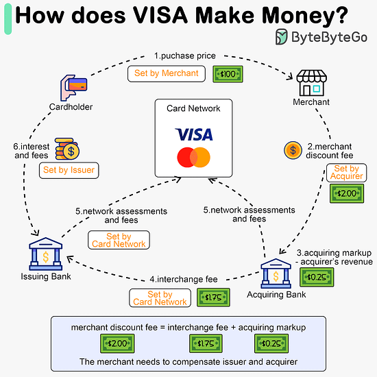

## How does Visa make money

1. The cardholder pays a merchant $100 to buy a product.

2. The merchant benefits from the use of the credit card with higher sales volume, and needs to compensate the issuer and the card network for providing the payment service. The acquiring bank sets a fee with the merchant, called the “𝐦𝐞𝐫𝐜𝐡𝐚𝐧𝐭 𝐝𝐢𝐬𝐜𝐨𝐮𝐧𝐭 𝐟𝐞𝐞.”

3 - 4. The acquiring bank keeps $0.25 as the 𝐚𝐜𝐪𝐮𝐢𝐫𝐢𝐧𝐠 𝐦𝐚𝐫𝐤𝐮𝐩, and $1.75 is paid to the issuing bank as the 𝐢𝐧𝐭𝐞𝐫𝐜𝐡𝐚𝐧𝐠𝐞 𝐟𝐞𝐞. The merchant discount fee should cover the interchange fee.

The interchange fee is set by the card network because it is less efficient for each issuing bank to negotiate fees with each merchant.

5. The card network sets up the 𝐧𝐞𝐭𝐰𝐨𝐫𝐤 𝐚𝐬𝐬𝐞𝐬𝐬𝐦𝐞𝐧𝐭𝐬 𝐚𝐧𝐝 𝐟𝐞𝐞𝐬 with each bank, which pays the card network for its services every month. For example, VISA charges a 0.11% assessment, plus a $0.0195 usage fee, for every swipe.

6. The cardholder pays the issuing bank for its services.

Why should the issuing bank be compensated?

- The issuer pays the merchant even if the cardholder fails to pay the issuer.
- The issuer pays the merchant before the cardholder pays the issuer.
- The issuer has other operating costs, including managing customer accounts, providing statements, fraud detection, risk management, clearing & settlement, etc.
